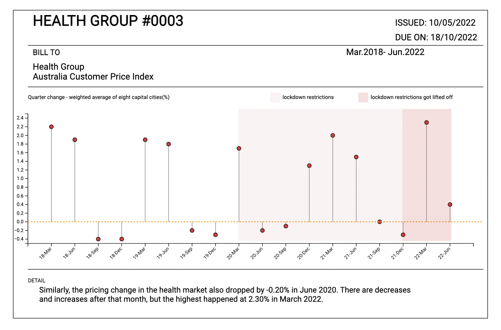

# Sydney-CPI-During-Lockdown

## This is a data visualization report that compares the CPI in Sydney between pre and post lockdown. 

 

### DESIGN RATIONALE

In March 2020, nations across the globe had to implement lockdowns and close their borders to prevent the spread of the COVID-19 virus. Due to the increasing unemployment, people had to cut out their spending. The Consumer Price Index (CPI) measures the average changes over time in terms of prices consumers pay in exchange for goods and services. These recorded data are used to determine financial decisions from various financial institutions such as banks and governments. CPI measures different expenditures such as food and beverages, education, recreation, transportation, etc. We decided to focus on the following four groups: food and beverages, housing, transport, and health because we believe that these are the most prioritized needs by consumers.

 

##  Thank you for shopping with Australia
### The changes of living cost before and during the pandemic.

 

Our group intends to show how the ongoing pandemic has motivated consumers to prioritize some groups over others. The report compares the quality of living before and after the announcement of the pandemic lockdown restrictions. Thus, the data trend we are reaching is from the second quarter of 2020 to the last quarter of 2021. The post-lockdown timeframe begins with the previous quarter of 2021 and ends with the most recent data, which is the second quarter of 2022. In June 2020, we learned that most of the significant drops occurred in the groups above, except for food and beverages, which only had a minor drop compared to the last quarter. Another reason for choosing this quarter as a cut-off point, it coincided with the time when many people got laid off and when the Australian government actively provided services and benefits to its citizens. When designing this data visualization, we considered numerous factors, including our concept, chart types, colours, and more. These factors are closely related to purchasing and consumers so that the audience could understand what we wanted to tell at first glance.

Throughout the report, black and white colours have been set as the primary background colours. This colour scheme brings simplicity and increases the readability of the data. These receipts also include barcodes at the end of the layouts. We incorporated the style of receipts as the structure for this data visualization report. Two receipts will represent the significant drops and increases that happened when lockdown restrictions were in place and after these restrictions got lifted. The usage of this style allows us to display our data clearly and concisely and reflect the symbolism of the consumers' purchasing power.

During the research phase, we identified four major categories of CPI representing inflation and deflation in a healthy economy. (Housing, Transport, Health and Food and Beverages). Previously, these four market groups were illustrated in different chart types. However, changes were made after getting multiple rounds of feedback from the teaching team. For the four market groups, we turned their charts into lollipop charts to explicitly show the ranking of the numbers and illustrate the differences between the CPI groups in two specific periods. Furthermore, we used a line chart to describe and compare all four market groups. To achieve this, we have used different colours for each data to represent each market which is the same as the colours used in the receipts to keep consistency. This is to show the audience a clear and detailed visualization of the needs and how consumers' priorities differ in the middle of the pandemic.

The colours used inside the charts and receipts were inspired by the most popular brands that consumers purchase from for each market group. As part of the illustration design, we have created pixel art icons based on commercials printed on receipts. It is common for commercials to be published in black and white with pixelated images—this receipt documents data in pixel style.

To wrap up, we divided the four major expenditures into four different graphs, which are illustrated inside four separate invoices. We used one big receipt to capture these four individual data sets and make one big story regarding the purchasing history of consumers in Australia and how the COVID-19 pandemic has affected it.

 
 

Group Outliter | Grethel Juanata SID 510234238 Unikey GJUA9925 | Sirui Wang (Jenny) SID 510574341 Unikey SWAN8728 | Sau Kei Kwok (Suki) SID 500645127 Unikey SKWO3372 | Ying Wang SID 510605900 Unikey YWAN3697
 

For more information please check the presentaion slide: https://www.canva.com/design/DAFOB0KYju0/dusEPATiWI1wbvr2Alshzw/view?utm_content=DAFOB0KYju0&utm_campaign=designshare&utm_medium=link2&utm_source=sharebutton
 

All data are from Consumer Price Index, Australia: https://www.abs.gov.au/statistics/economy/price-indexes-and-inflation/consumer-price-index-australia/latest-release.